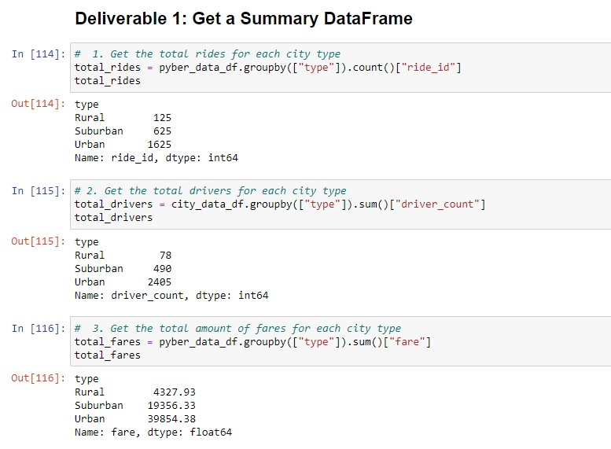
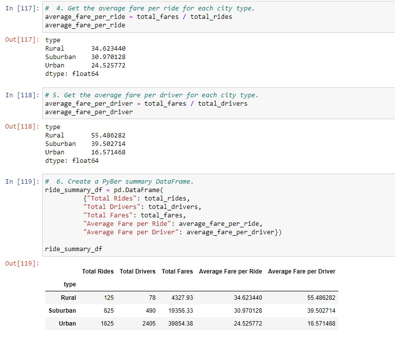
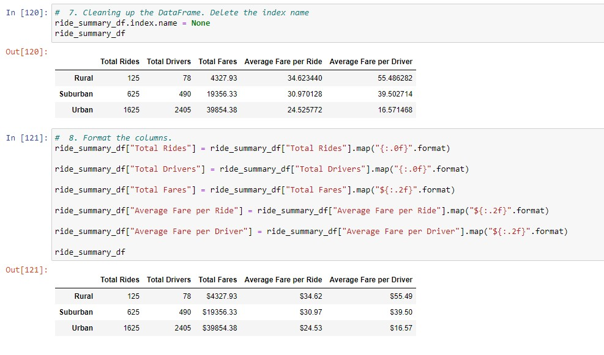
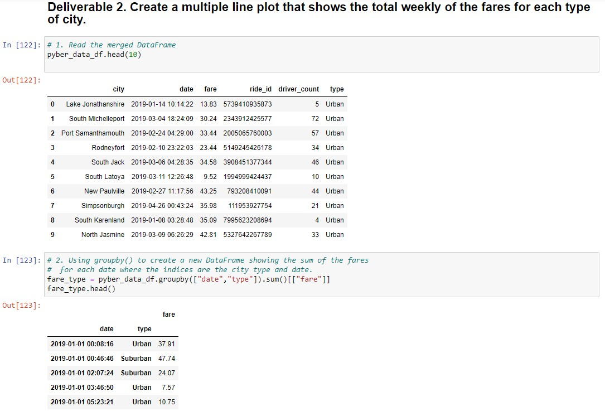
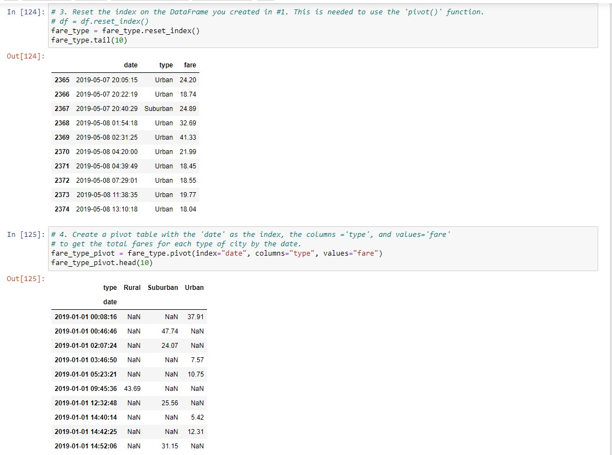
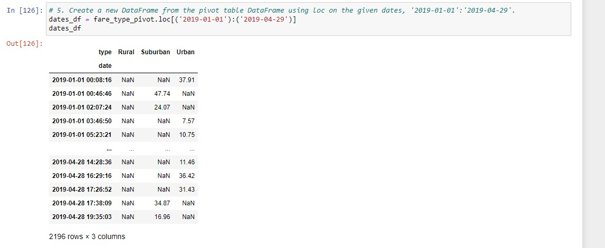
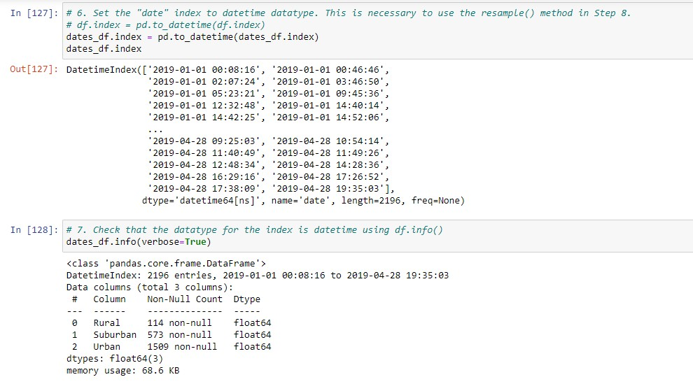
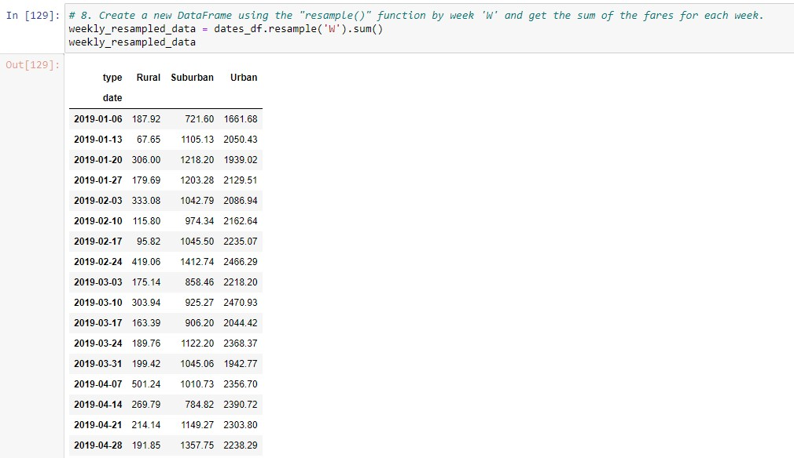
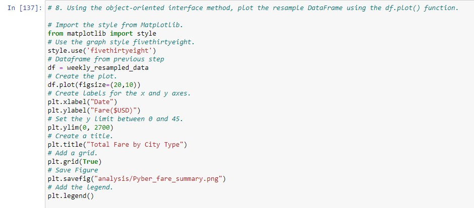
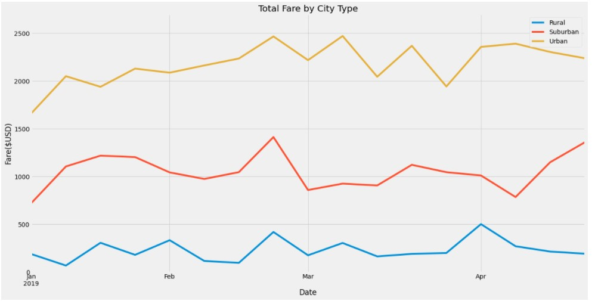

# PyBer_Analysis
## Analyze and visualize ride-sharing data using the power of Python, Pandas and Matplotlib
### Originally the [PyBer.ipynb](PyBer.ipynb) report had the following deliverables:
* Verify, import, and merge data frames.
* Create bubble charts that showcases the average fare versus the total number of rides with bubble size based on the total number of drivers for each city type, including urban, suburban, and rural.
* There was also a mean, median and mode data calculated for each city type.
* Numerous bubble charts, box and whisker plots and pie charts showing the total percent of total fares, rides, and drivers.

## Deliverable 3 Instructions
Use your repository README file to write your analysis of how to address any disparities in the ride-sharing data among the city types.
The analysis should contain the following:

### Overview of the analysis: Explain the purpose of the new analysis.
Results: Using images from the summary DataFrame and multiple-line chart, describe the differences in ride-sharing data among the different city types.
Summary: Based on the results, provide three business recommendations to the CEO for addressing any disparities among the city types.

## Deliverable 3 Requirements
* Structure, Organization, and Formatting (6 points)
* The written analysis has the following structure, organization, and formatting:

## DELIVERABLE 3 RUBRIC
### There is a title, and there are multiple sections. (2 pt)
### Each section has a heading and subheading. (2 pt)
### Links to images are working and displayed correctly. (2 pt)

## Analysis (14 points)
The written analysis has the following:
### Overview of the analysis:
The purpose of the new analysis is well defined. (3 pt)
### Results:
There is a description of the differences in ride-sharing data among the different city types. 
Ride-sharing data include the total rides, total drivers, total fares, average fare per ride and driver, and total fare by city type. (7 pt)
### Summary:
There is a statement summarizing three business recommendations to the CEO for addressing any disparities among the city types. (4 pt)

## Submission
Once you’re ready to submit, make sure to check your work against the rubric to ensure you are meeting the requirements for this Challenge one final time. It’s easy to overlook items when you’re in the zone!

As a reminder, the deliverables for this Challenge are as follows:

Deliverable 1: A ride-sharing summary DataFrame by city type.
Deliverable 2: A multiple-line chart of total fares for each city type.
Deliverable 3: A written report for the PyBer analysis (README.md).
Upload the following to your PyBer_Analysis GitHub repository:

The PyBer_Challenge.ipynb file.
The results need to be kept populated in the PyBer_Challenge.ipynb file. Do not clear the output from the PyBer_Challenge.ipynb file before uploading to GitHub.
The “Resources” folder with the city_data.csv and ride_data.csv files.
The “analysis” folder with the PyBer_fare_summary.png.
An updated README.md that has your written analysis.
